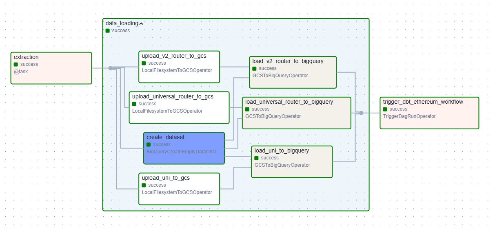

# Ethereum On-Chain Intelligence

A tool for analyzing and deriving insights from Ethereum blockchain data.
detecting wash trading on AMM exchanges withinEthereum-like systems, based on the understanding that colluding addresses (perceived as the same entity).

## Overview

This project provides tools and utilities for gathering, analyzing, and visualizing on-chain Ethereum data to derive meaningful intelligence and insights.

## Features

- On-chain data collection and processing
- Analytics and metrics calculation
- Data visualization capabilities
- Real-time monitoring options
- Google Cloud integration for scalable data storage and processing

## Getting Started
### Prerequisites
- Install Git (if not already installed)
- Install Python (if not already installed)
- Install Docker (if not already installed)
- memory : 1234
- storage : 1234
- Node.js (v16 or higher)
- Access to an Ethereum node (local or remote)
- Google Cloud Platform account (for BigQuery and GCS integrations)

### Installation
-Use terraform option 


## Run Airflow

### Environment Variables

Before running Airflow, make sure to set up the required environment variables:

1. Create or update the `.env` file in the `airflow` directory:
   ```bash
   cd airflow
   touch .env
   ```

2. Add your Etherscan API key and other configuration variables to the `.env` file:
   ```
   ETHERSCAN_API_KEY="your_etherscan_api_key_here"
   BQ_DATASET_ID="your_bigquery_dataset_id"  # Required: BigQuery dataset ID
   BUCKET_NAME="your_gcs_bucket_name"              # Required: GCS bucket name
   ```
   
   These variables are required for fetching data from Etherscan's API services and configuring the Google Cloud storage.

3. The project expects environment variables to be loaded using direnv:
   - Install direnv if not already installed
   - The project already includes a `.envrc` file in the `airflow` directory with the simple command `dotenv`, which automatically loads variables from the `.env` file
   - After creating your `.env` file, allow direnv to load the variables:
     ```bash
     cd airflow
     direnv allow
     ```
   - Verify with `direnv status` that your environment variables are loaded

4. Alternatively, you can set the environment variables directly:
   ```bash
   export ETHERSCAN_API_KEY="your_etherscan_api_key_here"
   export BQ_DATASET_ID="your_bigquery_dataset_id"  # Required
   export BUCKET_NAME="your_gcs_bucket_name"  # Required
   ```

5. Set up Google Cloud credentials by placing your service account key JSON file at:
   ```
   airflow/config/application_credentials.json
   ```

Note: Never commit your API keys or credentials to version control. The `.env` file and credentials are included in `.gitignore`.

### Running Airflow

To run Apache Airflow for workflow orchestration:

1. Navigate to the Airflow directory:
   ```bash
   cd airflow
   ```

2. Start Airflow using Docker Compose:
   ```bash
   docker-compose up -d
   ```

3. Access the Airflow web interface:
   - Open your browser and go to: http://localhost:8080
   - Default login credentials:
     - Username: airflow
     - Password: airflow

4. DAGs are stored in the `airflow/dags` directory
   - The main Ethereum data processing DAG automatically handles:
     - Transaction data extraction from Etherscan
     - Data transformation to JSON Lines format
     - Loading data to Google Cloud Storage (GCS)
     - Creating BigQuery dataset and tables
     - Loading data from GCS to BigQuery for analysis

   
   *Ethereum data processing workflow in Airflow*

5. To stop Airflow:
   ```bash
   docker-compose down
   ```

### Required Dependencies

Airflow is configured with the following dependencies:
- apache-airflow==2.10.5
- apache-airflow-providers-google==11.0.0
- requests
- python-dotenv

Note: Logs are stored in the `airflow/logs` directory and data in `airflow/data`. Both directories are gitignored.


