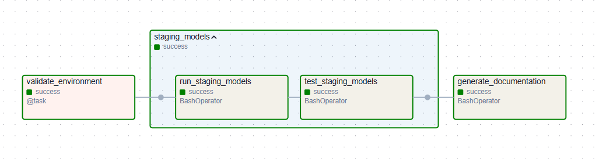

# Ethereum On-Chain Intelligence

A tool for analyzing and deriving insights from Ethereum blockchain data.
detecting wash trading on AMM exchanges withinEthereum-like systems, based on the understanding that colluding addresses (perceived as the same entity).

## Overview

This project provides tools and utilities for gathering, analyzing, and visualizing on-chain Ethereum data to derive meaningful intelligence and insights.

## Features

- On-chain data collection and processing
- Analytics and metrics calculation
- Data visualization capabilities
- Real-time monitoring options
- Google Cloud integration for scalable data storage and processing

## Getting Started
### Prerequisites
- Install Git (if not already installed)
- Install Python (if not already installed)
- Install Docker (if not already installed)
- memory : 1234
- storage : 1234
- Node.js (v16 or higher)
- Access to an Ethereum node (local or remote)
- Google Cloud Platform account (for BigQuery and GCS integrations)

### Installation
-Use terraform option


## Run Airflow

### Environment Variables

Before running Airflow, make sure to set up the required environment variables:

1. Create or update the `.env` file in the `airflow` directory:
   ```bash
   cd airflow
   touch .env
   ```

2. Add your Etherscan API key and other configuration variables to the `.env` file:
   ```
   ETHERSCAN_API_KEY="your_etherscan_api_key_here"
   BQ_DATASET_ID="your_bigquery_dataset_id"  # Required: BigQuery dataset ID
   BUCKET_NAME="your_gcs_bucket_name"              # Required: GCS bucket name
   ```

   These variables are required for fetching data from Etherscan's API services and configuring the Google Cloud storage.

3. The project expects environment variables to be loaded using direnv:
   - Install direnv if not already installed
   - The project already includes a `.envrc` file in the `airflow` directory with the simple command `dotenv`, which automatically loads variables from the `.env` file
   - After creating your `.env` file, allow direnv to load the variables:
     ```bash
     cd airflow
     direnv allow
     ```
   - Verify with `direnv status` that your environment variables are loaded

4. Alternatively, you can set the environment variables directly:
   ```bash
   export ETHERSCAN_API_KEY="your_etherscan_api_key_here"
   export BQ_DATASET_ID="your_bigquery_dataset_id"  # Required
   export BUCKET_NAME="your_gcs_bucket_name"  # Required
   ```

5. Set up Google Cloud credentials by placing your service account key JSON file at:
   ```
   airflow/config/application_credentials.json
   ```

Note: Never commit your API keys or credentials to version control. The `.env` file and credentials are included in `.gitignore`.

### Running Airflow

To run Apache Airflow for workflow orchestration:

1. Navigate to the Airflow directory:
   ```bash
   cd airflow
   ```

2. Start Airflow using Docker Compose:

   You have multiple options to run Airflow with Docker Compose:

   Option 1: Build and run in separate steps
   ```bash
   # First build the Docker images
   docker compose build

   # Then start the containers in detached mode
   docker compose up -d
   ```

   Option 2: Build and run in a single command
   ```bash
   # Build images and start containers in one command
   docker compose up -d --build
   ```

   Note: This project uses a custom Airflow Docker base image to accommodate the specific requirements for DBT integration. The custom image includes additional dependencies and configurations needed for DBT to interact with BigQuery and execute the data transformation workflows properly.

3. Access the Airflow web interface:
   - Open your browser and go to: http://localhost:8080
   - Default login credentials:
     - Username: airflow
     - Password: airflow

4. DAGs are stored in the `airflow/dags` directory
   - The main Ethereum data processing DAG automatically handles:
     - Transaction data extraction from Etherscan
     - Data transformation to JSON Lines format
     - Loading data to Google Cloud Storage (GCS)
     - Creating BigQuery dataset and tables
     - Loading data from GCS to BigQuery for analysis

   - The DBT workflow DAG (`dbt_ethereum_workflow`):
     - Transforms and models data in BigQuery using DBT
     - Runs data validation tests
     - Generates documentation
     - Is automatically triggered by the main Ethereum DAG upon successful completion
     - Executes after the ETL processes are complete

   
   *Ethereum data processing workflow in Airflow*

   
   *DBT workflow DAG*

5. To stop Airflow:
   ```bash
   docker compose down
   ```

### Required Dependencies

Airflow is configured with the following dependencies:
- apache-airflow==2.10.5
- apache-airflow-providers-google==11.0.0
- requests
- python-dotenv

Note: Logs are stored in the `airflow/logs` directory and data in `airflow/data`. Both directories are gitignored.

## DBT Data Transformation

The project includes a DBT (Data Build Tool) implementation for transforming and modeling Ethereum data in BigQuery.

### DBT Project Structure

The DBT project is located in the `airflow/dbt_project` directory and follows this structure:
- `models/` - Contains data transformation SQL files and YAML configurations
  - `staging/` - Initial data cleaning and validation models
  - `sources.yml` - Defines connections to source tables in BigQuery
- `macros/` - Reusable SQL macros and functions
- `dbt_project.yml` - Main DBT project configuration
- `profiles.yml` - Connection settings for BigQuery

### DBT Models

The project includes the following data models:

1. **Staging Models**:
   - `uni_transactions_cleaned` - Cleaned transaction data from UNI token or contracts
   - `uniswap_universal_router_transactions_cleaned` - Cleaned transactions interacting with Uniswap Universal Router
   - `uniswap_v2_router_transactions_cleaned` - Cleaned transactions interacting with Uniswap V2 Router

Each model validates data quality through dbt tests defined in schema.yml files, ensuring data consistency and completeness.

### Running DBT with Airflow

The project includes a dedicated Airflow DAG for orchestrating DBT workflows:

1. **DBT Ethereum Workflow DAG (`dbt_ethereum_workflow`)**:
   - Validates environment variables and configuration
   - Executes staging models
   - Runs data quality tests
   - Generates documentation

This DAG is designed to run automatically after the ETL processes complete, ensuring transformed data is immediately available for analysis.


### Environment Variables for DBT

DBT requires the following environment variables:
```
GCP_PROJECT_ID="your_gcp_project_id"  # Your Google Cloud project ID
BQ_DATASET_ID="your_bigquery_dataset_id"  # BigQuery dataset ID
```

These should be included in your `.env` file along with the other environment variables.

## Code Quality & Development

### Linting and Formatting

This project uses [Ruff](https://github.com/charliermarsh/ruff) for both linting and formatting Python code:

- **Linting**: Ruff provides fast Python linting with the following rules enabled:
  - `I`: Import sorting (isort)
  - `S`: Security checks (flake8-bandit)
  - `E`: PEP 8 errors (pycodestyle)
  - `N`: Naming conventions (pep8-naming)
  - `F`: Code checks (pyflakes)
  - `T20`: Print statement checks
  - `ANN`: Type annotation checks
  - `ARG`: Unused argument checks

- **Formatting**: Ruff's formatter ensures consistent code style with:
  - Line length: 120 characters
  - Target Python version: 3.10
  - Google-style docstrings

### Pre-commit Hooks

The project uses pre-commit to ensure code quality checks run before each commit:

1. Install pre-commit and other development dependencies:
   ```bash
   pip install -r requirements-dev.txt
   pre-commit install
   ```

2. Available hooks:
   - Standard file checks (trailing whitespace, file endings, YAML validation)
   - Ruff linting with automatic fixes
   - Ruff formatting

3. Run manually on all files:
   ```bash
   pre-commit run --all-files
   ```

4. Run a specific hook:
   ```bash
   pre-commit run ruff --all-files
   ```

Pre-commit ensures all code meets the project's quality standards before being committed.
